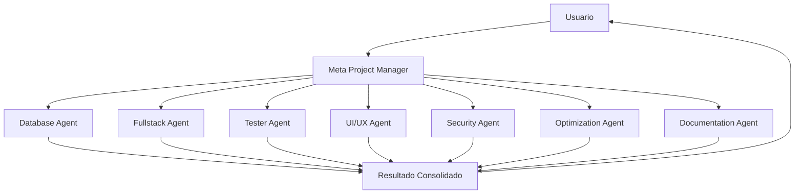

# Sistema Multi-Agente para ProjectOps Dashboard

Este directorio contiene las definiciones de los agentes de Claude Code que componen el sistema multi-agente del proyecto.

## Arquitectura del Sistema



## Agentes Disponibles

### 🎯 Meta Project Manager (`meta-project-manager`)
**El Coordinador Principal**

Agente maestro que orquesta todo el sistema. Analiza solicitudes del usuario, descompone tareas complejas, asigna trabajo a agentes especializados y consolida resultados.

**Invocar cuando**: Necesitas coordinar múltiples agentes para una tarea compleja.

---

### 🗄️ Database Agent (`database-agent`)
**Especialista en Bases de Datos**

Maneja todas las operaciones de base de datos: CRUD, schema design, migraciones, validaciones y optimización de queries.

**Skills**: JSON schema design, data modeling, migrations, backups
**Invocar cuando**: Necesitas crear/modificar schemas, realizar operaciones CRUD, migrar datos, o validar integridad de datos.

---

### 💻 Fullstack Agent (`fullstack-agent`)
**Desarrollador Full-Stack**

Experto en Angular 20, TypeScript 5.8, y desarrollo web moderno. Implementa features completas, servicios, componentes y refactoring.

**Skills**: Angular development, TypeScript, Signals, RxJS, architecture
**Invocar cuando**: Necesitas crear servicios, componentes, implementar features, o refactorizar código Angular/TypeScript.

---

### 🧪 Tester Agent (`tester-agent`)
**Especialista en Testing**

Crea tests unitarios, de integración y E2E. Analiza cobertura, detecta bugs y asegura calidad del código.

**Skills**: Unit testing, E2E testing, coverage analysis, bug detection
**Invocar cuando**: Necesitas generar tests, analizar cobertura, detectar bugs, o validar calidad del código.

---

### 🎨 UI/UX Agent (`ui-ux-agent`)
**Diseñador de Interfaces**

Especialista en diseño de UI/UX. Crea componentes visuales hermosos, responsive y accesibles siguiendo WCAG 2.1.

**Skills**: Component design, responsive layouts, accessibility, UX optimization
**Invocar cuando**: Necesitas diseñar componentes, mejorar UX, validar accesibilidad, o crear layouts responsive.

---

### 🔒 Security Agent (`security-agent`)
**Auditor de Seguridad**

Realiza auditorías de seguridad, escanea vulnerabilidades, verifica cumplimiento OWASP y asegura best practices.

**Skills**: Vulnerability scanning, XSS/CSRF prevention, input validation, OWASP compliance
**Invocar cuando**: Necesitas auditoría de seguridad, escaneo de vulnerabilidades, o validación de inputs.

---

### ⚡ Optimization Agent (`optimization-agent`)
**Optimizador de Performance**

Mejora velocidad, reduce bundle size, detecta memory leaks y optimiza Core Web Vitals.

**Skills**: Performance profiling, bundle optimization, memory leak detection, caching
**Invocar cuando**: Necesitas mejorar performance, reducir bundle size, detectar memory leaks, o optimizar Core Web Vitals.

---

### 📚 Documentation Agent (`documentation-agent`)
**Generador de Documentación**

Genera y mantiene documentación técnica clara y comprehensiva para código, APIs y proyectos.

**Skills**: Technical writing, API docs, README generation, diagrams (Mermaid)
**Invocar cuando**: Necesitas generar documentación, actualizar README, crear diagramas, o documentar APIs.

---

## Cómo Usar los Agentes

### Opción 1: Invocar al Meta Agent (Recomendado)

Para tareas complejas que requieren múltiples agentes, simplemente describe tu objetivo al Meta Project Manager:

```
@meta-project-manager Implementar sistema de notificaciones en tiempo real con base de datos, UI, tests y documentación
```

El Meta Agent automáticamente:
1. Analizará la solicitud
2. Descompondrá en subtareas
3. Asignará a los agentes apropiados
4. Coordinará la ejecución
5. Consolidará y reportará resultados

### Opción 2: Invocar Agentes Específicos

Para tareas específicas, puedes invocar directamente al agente apropiado:

```
@database-agent Crear schema para tabla de notificaciones con campos: id, userId, message, timestamp, read

@fullstack-agent Implementar servicio de notificaciones con métodos: getAll, markAsRead, delete

@ui-ux-agent Diseñar componente de notificaciones con lista, contador y badge

@tester-agent Generar tests unitarios para NotificationService

@documentation-agent Documentar API de notificaciones en formato Markdown
```

### Opción 3: Colaboración entre Agentes

Puedes solicitar colaboración explícita:

```
@meta-project-manager Coordinar a Fullstack Agent, Security Agent y Tester Agent para refactorizar el componente de autenticación asegurando seguridad y cobertura de tests
```

## Ejemplos de Uso

### Ejemplo 1: Nueva Feature Completa

```
@meta-project-manager Crear feature de comentarios en tareas:
- Base de datos para almacenar comentarios
- Servicio y componente Angular
- UI responsive y accesible
- Tests con 80%+ coverage
- Documentación de la feature
```

### Ejemplo 2: Auditoría y Mejora

```
@meta-project-manager Auditar el módulo de autenticación:
- Escanear vulnerabilidades de seguridad
- Analizar performance y optimizar
- Verificar cobertura de tests
- Actualizar documentación
```

### Ejemplo 3: Refactoring Guiado

```
@meta-project-manager Refactorizar TaskService:
- Migrar de RxJS a Signals
- Mejorar estructura y naming
- Actualizar tests
- Verificar que no rompe funcionalidad
```

### Ejemplo 4: Tarea Específica de Un Agente

```
@security-agent Realizar auditoría de seguridad completa del sistema de login, incluyendo:
- Validación de inputs
- Protección CSRF
- Manejo seguro de tokens
- Vulnerabilidades XSS
```

## Mejores Prácticas

### ✅ DO

- **Sé específico**: Describe claramente qué necesitas
- **Usa el Meta Agent**: Para tareas complejas o multi-dominio
- **Confía en la especialización**: Cada agente es experto en su área
- **Valida resultados**: Revisa el output de los agentes
- **Itera**: Los agentes pueden mejorar basándose en feedback

### ❌ DON'T

- **No microgestiones**: Los agentes saben cómo hacer su trabajo
- **No uses el agente equivocado**: Database Agent no hace UI
- **No ignores dependencies**: Respeta el orden sugerido
- **No omitas contexto**: Provee información relevante

## Flujo de Trabajo Típico

```
1. Usuario define objetivo
   ↓
2. Meta Agent analiza y planifica
   ↓
3. Agentes especializados ejecutan en orden
   ↓
4. Meta Agent consolida resultados
   ↓
5. Usuario recibe resultado completo
```

## Monitoreo y Logs

Los agentes mantienen logs de sus actividades en:
- Console output: Para debugging en desarrollo
- AgentLoggerService: Para auditoría y análisis

Puedes ver el estado del sistema en: http://localhost:4200/agents

## Limitaciones Conocidas

- Los agentes operan sobre el código localmente
- Cambios destructivos requieren aprobación del usuario
- Algunas operaciones tienen rate limits
- Los agentes respetan los constraints definidos

## Soporte y Feedback

Si un agente no funciona como esperabas:
1. Revisa la definición del agente en su archivo .md
2. Verifica que estás usando el agente correcto para la tarea
3. Proporciona más contexto en tu solicitud
4. Considera usar el Meta Agent para coordinación

## Versionado

- Versión actual: 1.0.0
- Última actualización: 2025-12-15
- Compatibilidad: Claude Code 0.9+

---

**Nota**: Este es un sistema en evolución. Los agentes aprenden y mejoran con el uso. Tu feedback ayuda a mejorar el sistema completo.
